Problem set \#3: Regression diagnostics, interaction terms, and missing data
================
Yiqing Zhu

-   [Regression diagnostics](#regression-diagnostics)
-   [Interaction terms](#interaction-terms)
-   [Missing data](#missing-data)

Regression diagnostics
======================

**Estimate the following linear regression model of attitudes towards Joseph Biden: *Y* = *β*0 + *β*1*X*1 + *β*2*X*2 + *β*3*X*3 where Y is the Joe Biden feeling thermometer, *X*1 is age, *X*2 is gender, and *X*3 is education. Report the parameters and standard errors.**

    ## Parsed with column specification:
    ## cols(
    ##   biden = col_integer(),
    ##   female = col_integer(),
    ##   age = col_integer(),
    ##   educ = col_integer(),
    ##   dem = col_integer(),
    ##   rep = col_integer()
    ## )

The model is estimated as below:

    ## 
    ## Call:
    ## lm(formula = biden ~ age + female + educ)
    ## 
    ## Residuals:
    ##    Min     1Q Median     3Q    Max 
    ##  -67.1  -14.7    0.7   18.9   45.1 
    ## 
    ## Coefficients:
    ##             Estimate Std. Error t value Pr(>|t|)    
    ## (Intercept)  68.6210     3.5960   19.08  < 2e-16 ***
    ## age           0.0419     0.0325    1.29      0.2    
    ## female1       6.1961     1.0967    5.65  1.9e-08 ***
    ## educ         -0.8887     0.2247   -3.96  7.9e-05 ***
    ## ---
    ## Signif. codes:  0 '***' 0.001 '**' 0.01 '*' 0.05 '.' 0.1 ' ' 1
    ## 
    ## Residual standard error: 23.2 on 1803 degrees of freedom
    ## Multiple R-squared:  0.0272, Adjusted R-squared:  0.0256 
    ## F-statistic: 16.8 on 3 and 1803 DF,  p-value: 8.88e-11

The estimate of parameter *β*0 is 68.6210 with standard error 3.5960, *β*1 0.0419 with standard error 0.0325, *β*2 6.1961 with standard error 1.0967, *β*3 -0.8887 with standard error 0.2247.

**1. Test the model to identify any unusual and/or influential observations. Identify how you would treat these observations moving forward with this research. Note you do not actually have to estimate a new model, just explain what you would do. This could include things like dropping observations, respecifying the model, or collecting additional variables to control for this influential effect.**

The following bubble plot identifies unusual obervations as pink triangles, unusual and influential observations as maroon squares.

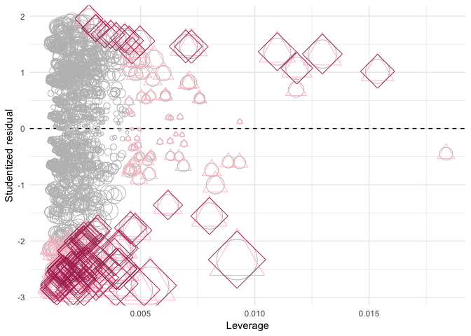

To deal with these unusual or/and influential observations, we try to find out the reasons for their unusualness.

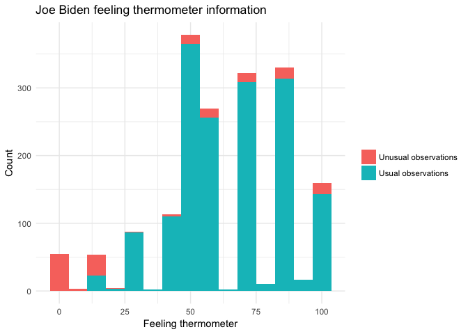

The above plot indicates that many unusual observations report Joe Biden feeling thermometer as 0, which should be considered as a reason for their statistical unusualness, however, it is pratically reasonable and is not the evidence for dropping them.

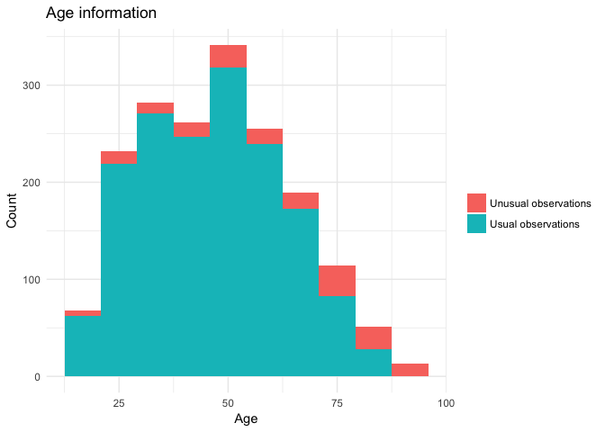

The above plot shows that people at a larger age is more represented in the unusual observations, and no obvious mistakes of age information can be observed.

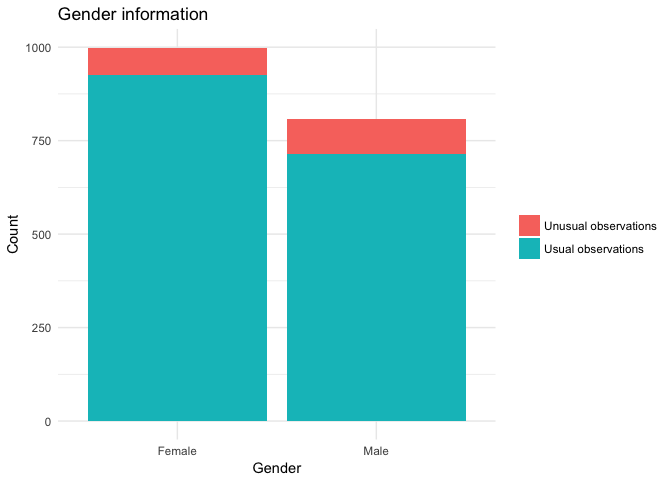

The above plot shows that the male is more represented in the unusual observations.

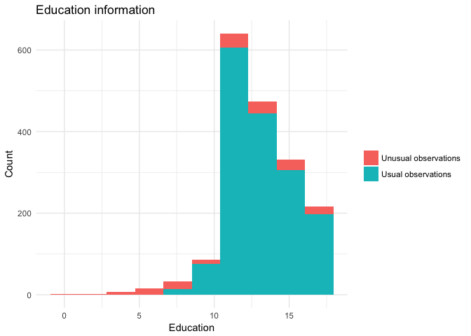

The above plot shows that people with low education level are more represented in unusual observations.

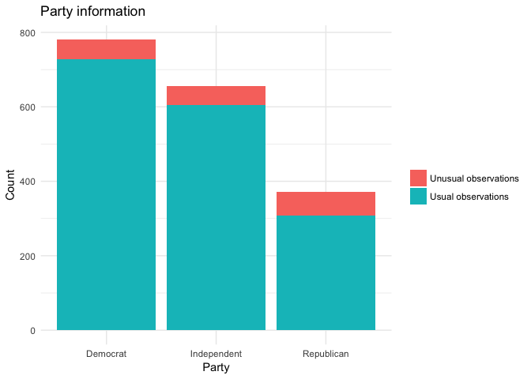

The above plot shows that Republicans are more represented in the unusual observations.

Overall, we can conclude that there are no obvious mistakes can be found among the unusual observations, and people with low Joe Biden feeling thermometer, larger age, male, low education level, and Republican are more represented in the unusual observations. Therefore, to treat the unusual observations, I would include party affiliation, interaction terms among age, gender, education level, and party affilication in the model, also, if possible, I can collect more data to make it more representative.

**2. Test for non-normally distributed errors. If they are not normally distributed, propose how to correct for them.**

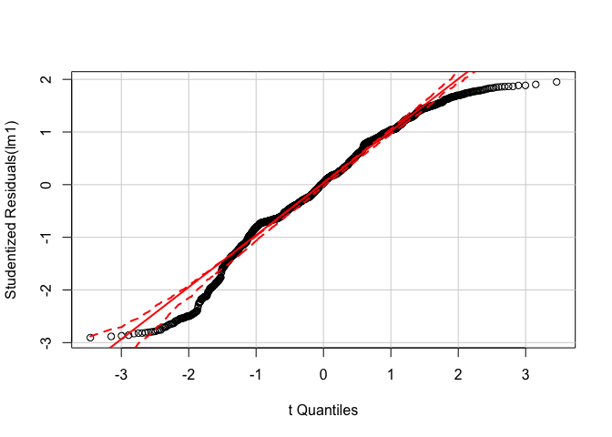

The above quantile-comparison plot shows that many observations fall outside the 95% C.I., which indicates that the normal distribution assumption has been violated. To solve this problem, power and log transformations are typically used.

To specify the exact tranformation needed, we use the boxcox method to evaluate the model *Y* + 1 = *β*0 + *β*1*X*1 + *β*2*X*2 + *β*3*X*3 (The Y+1 transformation results from the fact that there is 0 Joe Biden feeling thermometer in the dataset).

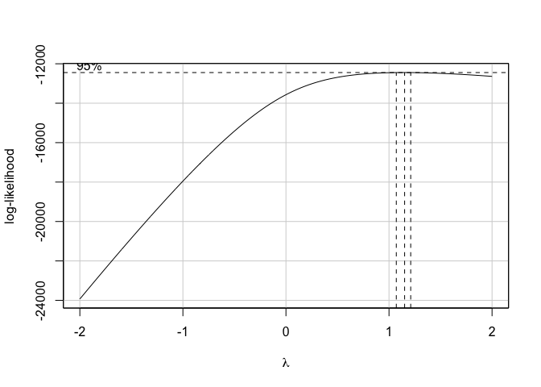

The above boxcox plot shows that = 1.2 is in the 95% C.I., therefore, we choose power transformation of Y. The new model is estimated and evaluated as below.

    ## 
    ## Call:
    ## lm(formula = biden^1.2 ~ age + female + educ)
    ## 
    ## Residuals:
    ##     Min      1Q  Median      3Q     Max 
    ## -158.39  -41.69   -0.69   50.84  125.81 
    ## 
    ## Coefficients:
    ##             Estimate Std. Error t value Pr(>|t|)    
    ## (Intercept) 160.0863     9.4913   16.87  < 2e-16 ***
    ## age           0.1416     0.0857    1.65    0.099 .  
    ## female1      16.1896     2.8946    5.59  2.6e-08 ***
    ## educ         -2.3163     0.5931   -3.91  9.7e-05 ***
    ## ---
    ## Signif. codes:  0 '***' 0.001 '**' 0.01 '*' 0.05 '.' 0.1 ' ' 1
    ## 
    ## Residual standard error: 61.1 on 1803 degrees of freedom
    ## Multiple R-squared:  0.0275, Adjusted R-squared:  0.0259 
    ## F-statistic:   17 on 3 and 1803 DF,  p-value: 6.99e-11

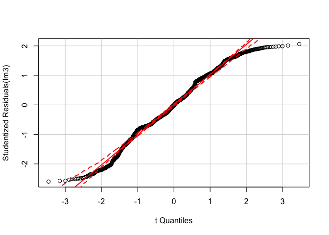

We can observe that the residuals are closer to normal distribution than before.

**3. Test for heteroscedasticity in the model. If present, explain what impact this could have on inference.**

    ## Loading required package: SparseM

    ## 
    ## Attaching package: 'SparseM'

    ## The following object is masked from 'package:base':
    ## 
    ##     backsolve

    ## Smoothing formula not specified. Using: y ~ qss(x, lambda = 5)

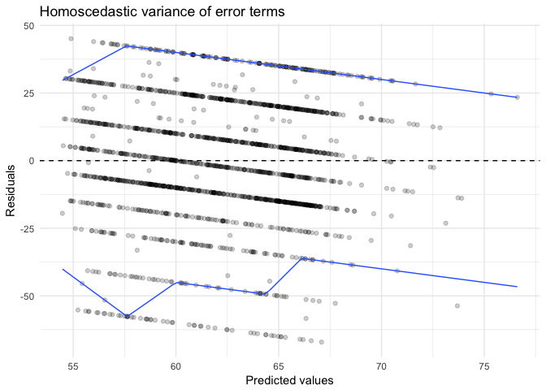

    ## 
    ##  studentized Breusch-Pagan test
    ## 
    ## data:  lm1
    ## BP = 20, df = 3, p-value = 5e-05

Both graphical test and statistical test shows that there is heteroscedasticity present in the model. This could result in biased standard errors and therefore, leads to biase in test-statistics and confidence intervals.

**4. Test for multicollinearity. If present, propose if/how to solve the problem.**

We can calculate variance inflation factor to evaluate the multicollinearity.

    ##    age female   educ 
    ##   1.01   1.00   1.01

Therefore, there is no multicollinearity present in the model and there is no problem to be solved.

Interaction terms
=================

**Estimate the following linear regression model: *Y* = *β*0 + *β*1*X*1 + *β*2*X*2 + *β*3*X*1*X*2 where Y is the Joe Biden feeling thermometer, *X*1 is age, and *X*2 is education. Report the parameters and standard errors.**

The model is estimated as below:

    ## 
    ## Call:
    ## lm(formula = biden ~ age * educ)
    ## 
    ## Residuals:
    ##    Min     1Q Median     3Q    Max 
    ## -70.54 -12.24  -0.94  20.50  44.74 
    ## 
    ## Coefficients:
    ##             Estimate Std. Error t value Pr(>|t|)    
    ## (Intercept)  38.3735     9.5636    4.01  6.3e-05 ***
    ## age           0.6719     0.1705    3.94  8.4e-05 ***
    ## educ          1.6574     0.7140    2.32    2e-02 *  
    ## age:educ     -0.0480     0.0129   -3.72    2e-04 ***
    ## ---
    ## Signif. codes:  0 '***' 0.001 '**' 0.01 '*' 0.05 '.' 0.1 ' ' 1
    ## 
    ## Residual standard error: 23.3 on 1803 degrees of freedom
    ## Multiple R-squared:  0.0176, Adjusted R-squared:  0.0159 
    ## F-statistic: 10.7 on 3 and 1803 DF,  p-value: 5.37e-07

The estimate of parameter *β*0 is 38.3735 with standard error 9.5636, *β*1 0.6719 with standard error 0.1705, *β*2 1.6574 with standard error 0.7140, *β*3 -0.0480 with standard error 0.0129.

**1. Evaluate the marginal effect of age on Joe Biden thermometer rating, conditional on education. Consider the magnitude and direction of the marginal effect, as well as its statistical significance.**

The marginal effect of age on Joe Biden thermometer rating conditional on education is estimated as below. The magnitude and direction of the marginal effect can be observed in the plot.

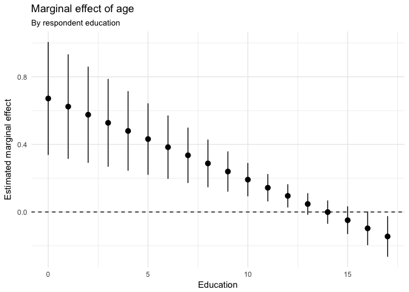

We can conduct hypothesis testing to evaluate its statistical significance.

    ## Linear hypothesis test
    ## 
    ## Hypothesis:
    ## age  + age:educ = 0
    ## 
    ## Model 1: restricted model
    ## Model 2: biden ~ age * educ
    ## 
    ##   Res.Df    RSS Df Sum of Sq    F Pr(>F)    
    ## 1   1804 985149                             
    ## 2   1803 976688  1      8461 15.6  8e-05 ***
    ## ---
    ## Signif. codes:  0 '***' 0.001 '**' 0.01 '*' 0.05 '.' 0.1 ' ' 1

The above testing results show that the marginal effect of age on Joe Biden thermometer rating, conditional on education, is statistically significant.

**2. Evaluate the marginal effect of education on Joe Biden thermometer rating, conditional on age. Consider the magnitude and direction of the marginal effect, as well as its statistical significance.**

The marginal effect of education on Joe Biden thermometer rating conditional on age is estimated as below. The magnitude and direction of the marginal effect can be observed in the plot.

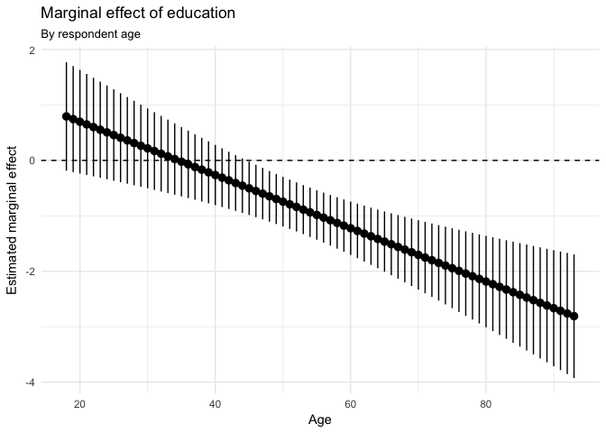

We can conduct hypothesis testing to evaluate its statistical significance.

    ## Linear hypothesis test
    ## 
    ## Hypothesis:
    ## educ  + age:educ = 0
    ## 
    ## Model 1: restricted model
    ## Model 2: biden ~ age * educ
    ## 
    ##   Res.Df    RSS Df Sum of Sq    F Pr(>F)  
    ## 1   1804 979537                           
    ## 2   1803 976688  1      2849 5.26  0.022 *
    ## ---
    ## Signif. codes:  0 '***' 0.001 '**' 0.01 '*' 0.05 '.' 0.1 ' ' 1

The above testing results show that the marginal effect of education on Joe Biden thermometer rating, conditional on age, is statistically significant.

Missing data
============

**Estimate the following linear regression model of attitudes towards Joseph Biden: *Y* = *β*0 + *β*1*X*1 + *β*2*X*2 + *β*3*X*3 where Y is the Joe Biden feeling thermometer, *X*1 is age, *X*2 is gender, and *X*3 is education. This time, use multiple imputation to account for the missingness in the data. Consider the multivariate normality assumption and transform any variables as you see fit for the imputation stage. Calculate appropriate estimates of the parameters and the standard errors and explain how the results differ from the original, non-imputed model.**

The model is estimated as below.

    ## Parsed with column specification:
    ## cols(
    ##   biden = col_integer(),
    ##   female = col_integer(),
    ##   age = col_integer(),
    ##   educ = col_integer(),
    ##   dem = col_integer(),
    ##   rep = col_integer()
    ## )

    ## The following objects are masked from data:
    ## 
    ##     age, biden, dem, educ, female, rep

    ## 
    ## Call:
    ## lm(formula = biden ~ age + female + educ)
    ## 
    ## Residuals:
    ##    Min     1Q Median     3Q    Max 
    ##  -66.8  -14.6    0.7   18.9   44.9 
    ## 
    ## Coefficients:
    ##             Estimate Std. Error t value Pr(>|t|)    
    ## (Intercept)  67.5579     3.5638   18.96  < 2e-16 ***
    ## age           0.0432     0.0323    1.34  0.18061    
    ## female1       6.0221     1.0899    5.53  3.8e-08 ***
    ## educ         -0.8146     0.2222   -3.67  0.00025 ***
    ## ---
    ## Signif. codes:  0 '***' 0.001 '**' 0.01 '*' 0.05 '.' 0.1 ' ' 1
    ## 
    ## Residual standard error: 23.1 on 1822 degrees of freedom
    ##   (497 observations deleted due to missingness)
    ## Multiple R-squared:  0.0252, Adjusted R-squared:  0.0236 
    ## F-statistic: 15.7 on 3 and 1822 DF,  p-value: 4.28e-10

The missingness for each variable is:

|  biden|  age|  female|  educ|
|------:|----:|-------:|-----:|
|    460|   46|       0|    11|

We can conduct a Mardia's MVN test to evaluate the multivariate normality assumption of the dataset.

    ##    Mardia's Multivariate Normality Test 
    ## --------------------------------------- 
    ##    data : data1_lite 
    ## 
    ##    g1p            : 0.9 
    ##    chi.skew       : 341 
    ##    p.value.skew   : 1.64e-72 
    ## 
    ##    g2p            : 9.21 
    ##    z.kurtosis     : 7.21 
    ##    p.value.kurt   : 5.61e-13 
    ## 
    ##    chi.small.skew : 342 
    ##    p.value.small  : 1.13e-72 
    ## 
    ##    Result          : Data are not multivariate normal. 
    ## ---------------------------------------

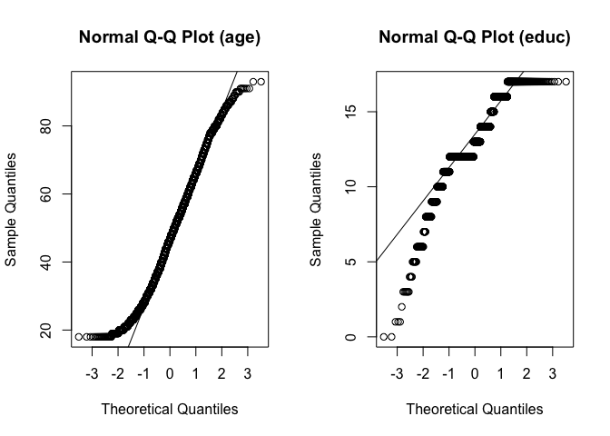

The data is not multivariate normal, and according to the plots above, we may consider power transformation of `educ`.

    ##    Mardia's Multivariate Normality Test 
    ## --------------------------------------- 
    ##    data : data1_trans %>% select(power_educ, age) 
    ## 
    ##    g1p            : 0.335 
    ##    chi.skew       : 127 
    ##    p.value.skew   : 1.96e-26 
    ## 
    ##    g2p            : 6.96 
    ##    z.kurtosis     : -6.22 
    ##    p.value.kurt   : 4.96e-10 
    ## 
    ##    chi.small.skew : 127 
    ##    p.value.small  : 1.71e-26 
    ## 
    ##    Result          : Data are not multivariate normal. 
    ## ---------------------------------------

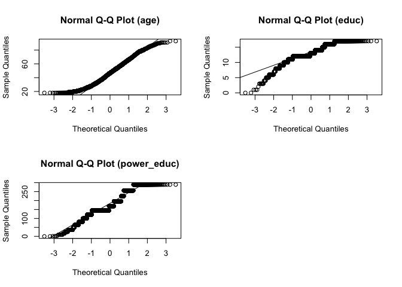

The test results and above plots indicate that though the tranformed data is still not multivariate normal, it is better than before. Thus, we power transform `educ` and use multiple imputation to account for the missingness in the data.

    ## Warning: There are observations in the data that are completely missing. 
    ##          These observations will remain unimputed in the final datasets. 
    ## -- Imputation 1 --
    ## 
    ##   1  2  3
    ## 
    ## -- Imputation 2 --
    ## 
    ##   1  2  3
    ## 
    ## -- Imputation 3 --
    ## 
    ##   1  2  3
    ## 
    ## -- Imputation 4 --
    ## 
    ##   1  2  3
    ## 
    ## -- Imputation 5 --
    ## 
    ##   1  2  3

    ## # A tibble: 20 × 6
    ##       id        term estimate std.error statistic   p.value
    ##    <chr>       <chr>    <dbl>     <dbl>     <dbl>     <dbl>
    ## 1   imp1 (Intercept)  61.2167   2.11343     28.97 2.83e-157
    ## 2   imp1         age   0.0379   0.02808      1.35  1.77e-01
    ## 3   imp1  power_educ  -0.0201   0.00763     -2.63  8.52e-03
    ## 4   imp1     female1   4.5520   0.97923      4.65  3.53e-06
    ## 5   imp2 (Intercept)  63.5935   2.10167     30.26 2.77e-169
    ## 6   imp2         age   0.0300   0.02790      1.08  2.82e-01
    ## 7   imp2  power_educ  -0.0312   0.00758     -4.12  4.00e-05
    ## 8   imp2     female1   4.8136   0.97266      4.95  8.01e-07
    ## 9   imp3 (Intercept)  63.1662   2.12446     29.73 2.25e-164
    ## 10  imp3         age   0.0307   0.02825      1.09  2.77e-01
    ## 11  imp3  power_educ  -0.0272   0.00766     -3.55  3.97e-04
    ## 12  imp3     female1   4.5642   0.98535      4.63  3.83e-06
    ## 13  imp4 (Intercept)  61.6391   2.12494     29.01 1.17e-157
    ## 14  imp4         age   0.0390   0.02820      1.38  1.67e-01
    ## 15  imp4  power_educ  -0.0225   0.00767     -2.93  3.42e-03
    ## 16  imp4     female1   4.6164   0.98354      4.69  2.84e-06
    ## 17  imp5 (Intercept)  63.8486   2.11786     30.15 3.02e-168
    ## 18  imp5         age   0.0316   0.02813      1.12  2.61e-01
    ## 19  imp5  power_educ  -0.0301   0.00764     -3.94  8.36e-05
    ## 20  imp5     female1   4.1639   0.98102      4.24  2.28e-05

The estimates of the parameters and the standard errors of both imputed and non-imputed model are listed below.

    ##          term estimate std.error        term estimate.mi std.error.mi
    ## 1 (Intercept)  67.5579    3.5638 (Intercept)     62.6928      2.48549
    ## 2         age   0.0432    0.0323         age      0.0339      0.02849
    ## 3     female1   6.0221    1.0899     female1      4.5420      1.01389
    ## 4        educ  -0.8146    0.2222  power_educ     -0.0262      0.00928

The above table indicates that the imputed model is slightly better than the non-imputed one, but there are not much difference, which may result from the fact that there are not many missing values in this dataset and the violation of multivariate normality assumption has not been well remedied.
